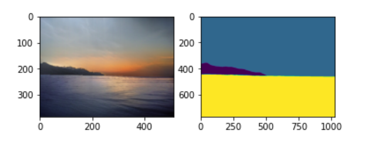

# Jittor 赛题1 - 风景图片生成


## 简介
本赛题将会提供1000张测试分割图片，参赛选手需要根据测试图片生成符合标签含义的风景图片。

本项目包含了第二届计图挑战赛计图 - 草图生成风景比赛的代码实现。本项目的特点是：将SPADE模型作为backbone进行训练。

## 安装 
本项目可在4 张 3090 上运行，训练时间约为 12 小时。

#### 运行环境
- jittor~=1.3.3.14
- numpy~=1.21.5
- opencv-python~=4.5.5.64
- Pillow~=9.0.0


#### 安装依赖
执行以下命令安装 python 依赖
```
pip install -r requirements.txt
```

#### 预训练模型
预训练模型模型在目录 checkpoints 下。

## 训练
训练可以运行以下命令：
```
bash run.sh
```

## 推理
生成测试集上的结果可以运行以下命令：

```
bash test.sh
```

## 致谢
- Semantic Image Synthesis with Spatially-Adaptive Normalization
- YOU ONLY NEED ADVERSARIAL SUPERVISION FOR SEMANTIC IMAGE SYNTHESIS
- Image Synthesis via Semantic Composition

- 部分代码参考了 [jittor-gan](https://github.com/Jittor/gan-jittor)。
